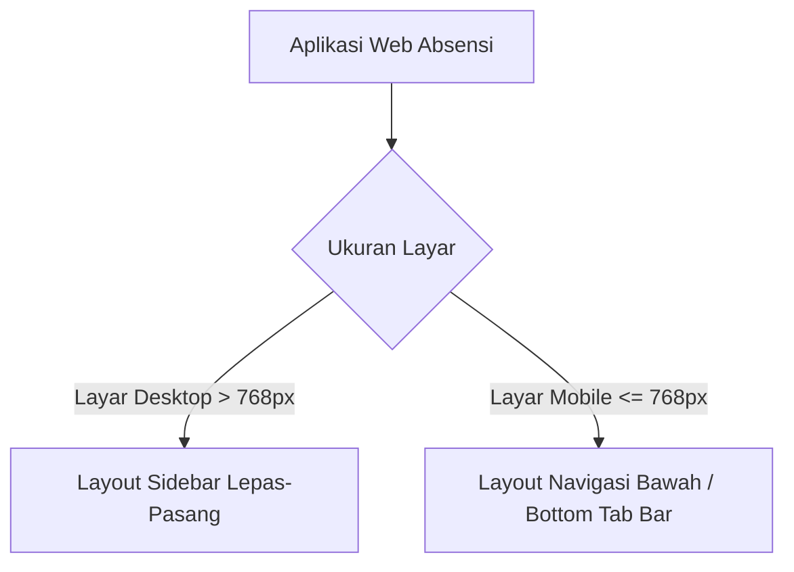

# Web Absensi Digital — Panduan UI & Design System
**MA. Miftahul Ulum 2**

Dokumen ini berisi spesifikasi lengkap mengenai sistem antarmuka (UI) dan sistem desain (Design System) yang digunakan pada aplikasi web absensi guru MA. Miftahul Ulum 2. Sistem desain ini dibuat dengan mengadaptasi pedoman **Apple Human Interface Guidelines (HIG)** untuk memberikan pengalaman pengguna yang premium, intuitif, dan responsif.

---

## 1. Filosofi Desain & Estetika
Aplikasi web ini menggunakan tema **Dark Mode** premium yang terinspirasi dari iOS Pro. Estetika UI didasarkan pada:
*   **Vibrant Colors & Glassmorphism**: Penggunaan gradien halus, latar belakang semi-transparan (efek *frosted glass*), dan warna sistem yang kontras dan nyaman di mata.
*   **Micro-Animations**: Transisi halus saat perpindahan tab, klik tombol, *swipe*, dan pemuatan halaman (*skeletons*).
*   **Tampilan Bersih & Rapi**: Menghindari elemen visual yang berantakan dengan memaksimalkan penggunaan kartu (*cards*), batas melingkar (*border-radius*), serta ikon outline (SF Symbols equivalent).

---

## 2. Design Tokens (CSS Variables)

Semua token desain didefinisikan secara terpusat di [index.css](file:///d:/NUS/AbsenNew/Bot%202026/web/src/index.css). Berikut adalah ringkasan variabel utama:

### A. Palet Warna (iOS Dark Palette)
| Variabel CSS | Nilai Hex / RGBA | Representasi Visual | Penggunaan Utama |
| :--- | :--- | :--- | :--- |
| `--bg-primary` | `#0D1117` | Latar belakang dasar | Latar belakang aplikasi utama |
| `--bg-secondary` | `#171B22` | Latar belakang kartu | Kartu utama (*cards*), panel daftar |
| `--bg-tertiary` | `#1C222B` | Latar belakang sekunder | Kartu di dalam kartu, kolom isian |
| `--bg-elevated` | `rgba(32, 34, 40, 0.72)` | Transparan berkabut | Header, lembar modal (*glassmorphism*) |
| `--label-primary` | `#FFFFFF` | Putih | Teks utama, judul utama |
| `--label-secondary`| `#A1A1AA` | Abu-abu muda | Deskripsi, info sekunder, caption |
| `--blue` | `#0A84FF` | Biru terang | Warna primer, tombol aktif, tautan |
| `--green` | `#30D158` | Hijau | Status HADIR, sinkronisasi sukses |
| `--yellow` | `#FFD60A` | Kuning | Status IZIN, peringatan sedang |
| `--orange` | `#FF9F0A` | Oranye | Status SAKIT, scheduler tertunda |
| `--red` | `#FF453A` | Merah | Status ALPHA, error, aksi destruktif |
| `--purple` | `#BF5AF2` | Ungu | Kategori khusus, ekspor Excel |
| `--separator` | `rgba(255, 255, 255, 0.06)` | Garis tipis transparan | Pembatas antar baris/konten |

### B. Tipografi & Skala Font (SF Pro & Inter)
Tipografi disesuaikan dengan skala *dynamic type* milik iOS:
*   **Font Family**: `SF Pro Display`, `SF Pro Text`, `Inter`, dan sistem sans-serif MacOS/Windows.
*   **Skala Ukuran Teks**:
    *   `--fs-large-title`: `34px` (Judul halaman utama)
    *   `--fs-title-1`: `28px` (Judul bagian besar)
    *   `--fs-title-2`: `22px` (Judul modul)
    *   `--fs-headline`: `17px` (Tebal, untuk item baris penting)
    *   `--fs-body`: `17px` (Ukuran teks standar)
    *   `--fs-footnote` / `--fs-caption`: `13px` (Teks bantuan, log, info tanggal)

---

## 3. Komponen Reusable (iOS Style)

Komponen modular diimplementasikan di [App.jsx](file:///d:/NUS/AbsenNew/Bot%202026/web/src/App.jsx) dengan optimalisasi performa melalui `React.memo()`.

### 1. `IOSButton`
Tombol taktil yang mendukung pemuatan (*loading state*), dinonaktifkan (*disabled*), dan empat varian visual:
*   **Props**: `children`, `onClick`, `variant` (`primary` | `secondary` | `destructive` | `outline` | `tertiary`), `disabled`, `loading`, `style`, `ariaLabel`, `type`
*   **Penggunaan**:
    ```jsx
    <IOSButton variant="primary" onClick={handleSave} loading={actionLoading}>
      Simpan Perubahan
    </IOSButton>
    ```

### 2. `IOSCard`
Kontainer dengan sudut melingkar besar (`20px`), bayangan halus, dan interaksi taktil saat diarahkan (*hover*).
*   **Props**: `children`, `interactive` (boolean untuk efek hover), `style`, `onClick`
*   **Penggunaan**:
    ```jsx
    <IOSCard interactive onClick={() => console.log('Card clicked')}>
      <h3>Judul Kartu</h3>
      <p>Deskripsi konten kartu...</p>
    </IOSCard>
    ```

### 3. `IOSSection`
Membagi halaman ke dalam grup-grup logis, memiliki judul di bagian atas (*header*), dan catatan kaki opsional (*footer*).
*   **Props**: `children`, `title` (string/node), `footer` (string/node)

### 4. `IOSList` & `IOSListRow`
Struktur baris khas aplikasi pengaturan iOS. Sangat cocok untuk menampilkan data berurutan, form opsi, atau daftar guru.
*   **`IOSList` Props**: `children`, `className`, `style`
*   **`IOSListRow` Props**: `children` (konten kiri), `onClick`, `interactive` (boolean), `rightContent` (konten kanan), `chevron` (boolean untuk ikon panah kanan), `className`
*   **Penggunaan**:
    ```jsx
    <IOSList>
      <IOSListRow rightContent={<span>14:30 WIB</span>} chevron interactive onClick={openDetail}>
        <span>Jadwal Pengiriman Otomatis</span>
      </IOSListRow>
    </IOSList>
    ```

### 5. `AppleSelect`
Dropdown kustom pengganti `<select>` bawaan browser. Menggunakan animasi lembaran popover iOS dengan dukungan inersia gulir (*scroll inertia*).
*   **Props**: `value`, `onChange`, `options` (array of `{ value, label }`), `style`, `ariaLabel`, `className`

### 6. `AppleDatePicker`
Komponen pemilih tanggal kustom bergaya kalender iOS 17. Menyediakan antarmuka overlay *bottom-sheet* transparan, navigasi antar bulan yang halus, penunjuk tanggal hari ini (*today indicator*), dan penutup otomatis.
*   **Props**: `value` (format `YYYY-MM-DD`), `onChange`

### 7. `IOSSwitch`
Tombol geser (*toggle slider*) hijau khas iOS untuk pengaturan on/off.
*   **Props**: `checked`, `onChange`, `ariaLabel`

### 8. `IOSBadge`
Label status dengan warna kontras melingkar penuh (*pill badge*).
*   **Status Didukung**:
    *   `HADIR` (Latar hijau, teks putih)
    *   `IZIN` (Latar kuning, teks hitam)
    *   `SAKIT` (Latar oranye, teks putih)
    *   `ALPHA` (Latar merah, teks putih)
    *   `LIBUR` (Latar biru, teks putih)
    *   `BELUM` (Latar abu-abu, teks abu-abu muda)

### 9. `IOSAvatar`
Inisial melingkar untuk nama guru dengan generator warna latar belakang dinamis berdasarkan algoritma hash string nama.
*   **Props**: `name` (string)

### 10. `IOSSheet` & `IOSAlert`
*   **`IOSSheet`**: Modal interaktif bergaya lembar seret (*bottom sheet*) yang muncul dari bawah layar dengan pegangan seret (*grabber*).
*   **`IOSAlert`**: Kotak dialog peringatan bergaya iOS Dialog Box dengan opsi aksi bold (aksi default) atau merah (aksi destruktif).

---

## 4. Mode Interaksi Khusus & Gestur

### A. Focus Card Mode (Swipe Gestures)
Mode khusus untuk mempermudah guru piket melakukan absensi di perangkat seluler (layar potret) tanpa harus mengetuk tombol kecil:
1.  **Cara Masuk**: Melalui tombol "Mulai Mode Fokus" di bagian atas daftar absensi harian.
2.  **Antarmuka**: Satu nama guru ditampilkan sebagai kartu raksasa di tengah layar dengan tombol status yang besar di bawahnya.
3.  **Sistem Gestur Pointer (Touch/Mouse)**:
    *   Dibuat dengan memanfaatkan event pointer (`onPointerDown` dan `onPointerUp`) untuk mendeteksi arah geseran (*swipe*).
    *   **Geser Ke Atas (Swipe Up)**: Berpindah ke guru berikutnya di daftar. Jika berada di guru terakhir, sistem akan otomatis berpindah ke jam berikutnya (misal Jam 1 -> Jam 2) dan menampilkan konfirmasi selesai.
    *   **Geser Ke Bawah (Swipe Down)**: Kembali ke guru sebelumnya atau kembali ke mode daftar biasa jika berada di guru pertama.
4.  **Touch Action Control**: Kontainer gesture menggunakan CSS `touch-action: none` untuk mencegah bentrok dengan gerakan gulir bawaan browser.

### B. Queue Toast System (Antrean Notifikasi)
Sistem toast notifikasi kustom yang menjamin setiap pesan status dibaca oleh pengguna tanpa mengganggu visual utama:
*   **Antrean Non-Duplikasi**: Jika pesan dan tipe notifikasi yang sama dipicu berturut-turut, sistem akan menduplikasi/mengabaikan agar tidak menumpuk.
*   **Auto Dismiss**: Setiap notifikasi akan aktif selama `2.8 detik`, kemudian melakukan transisi memudar (*exiting transition*) secara otomatis sebelum dihapus dari memori.

---

## 5. Layout Responsif & Shell Navigasi

Aplikasi ini menggunakan tata letak dinamis yang menyesuaikan diri secara mulus di berbagai perangkat:



### A. Tampilan Desktop
*   **Sidebar Navigation**: Menu navigasi diletakkan di panel kiri permanen yang dapat dilipat (*collapsed state*) untuk memaksimalkan ruang kerja utama. Status lipatan disimpan di `localStorage` agar konsisten saat halaman dimuat ulang.
*   **Tabel Ringkasan**: Rekap bulanan disajikan dalam bentuk tabel detail dengan kolom yang lengkap (No, Nama, JTM, Jadwal, Hadir, Izin, Sakit, Libur, Alpa).

### B. Tampilan Mobile (Potret)
*   **Bottom Navigation Bar (TabBar)**: Panel navigasi melayang di bawah layar dengan ikon minimalis yang mudah dijangkau ibu jari pengguna.
*   **Daftar Ringkas**: Mengubah tabel rekap yang kompleks menjadi deretan kartu daftar `IOSListRow` dengan inisial avatar guru dan indikator status cepat di sebelah kanan.
*   **Safe Area Padding**: Mendukung CSS padding `env(safe-area-inset-bottom)` dan `env(safe-area-inset-left/right)` untuk memastikan konten tidak terpotong oleh lekukan layar (*notch*) pada iPhone modern atau sistem navigasi gestur Android.

---

## 6. Integrasi UI & Hak Akses
Elemen antarmuka secara otomatis menyesuaikan diri berdasarkan peran pengguna (`SUPERADMIN`, `ADMIN`, dan `USER`) dengan memanfaatkan helper `hasPermission()`:
1.  **Tab Absensi**: Tombol pemilihan massal status absensi hanya ditampilkan kepada pengguna dengan hak `input_absensi`. Ikon pensil koreksi status hanya aktif jika memiliki hak `koreksi_absensi`.
2.  **Tab Rekap Bulanan**: Tombol integrasi "Sinkronisasi Data" Google Sheets serta menu ekspor laporan ke PDF/Excel via WhatsApp disembunyikan bagi pengguna non-admin.
3.  **Tab Admin**: Panel kontrol scheduler pengiriman harian, alarm KBM manual, pengelolaan retensi penyimpanan log, serta panel siaran pesan WhatsApp hanya dapat diakses oleh peran admin/superadmin.
4.  **Tab Permissions**: Hak akses per-peran ini dapat diubah secara interaktif melalui tabel matriks izin di tab khusus yang hanya dapat dilihat oleh `SUPERADMIN`. Setiap perubahan izin langsung memperbarui status UI secara instan dan mencatat aktivitasnya ke Log Sistem.
